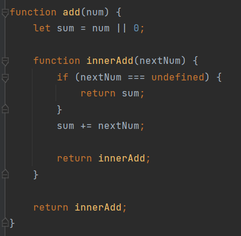
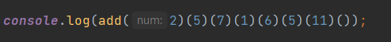
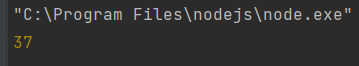
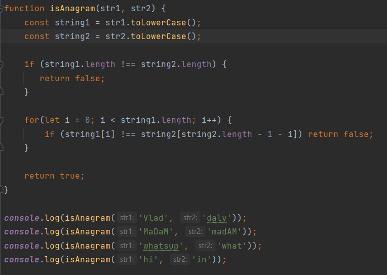
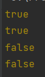
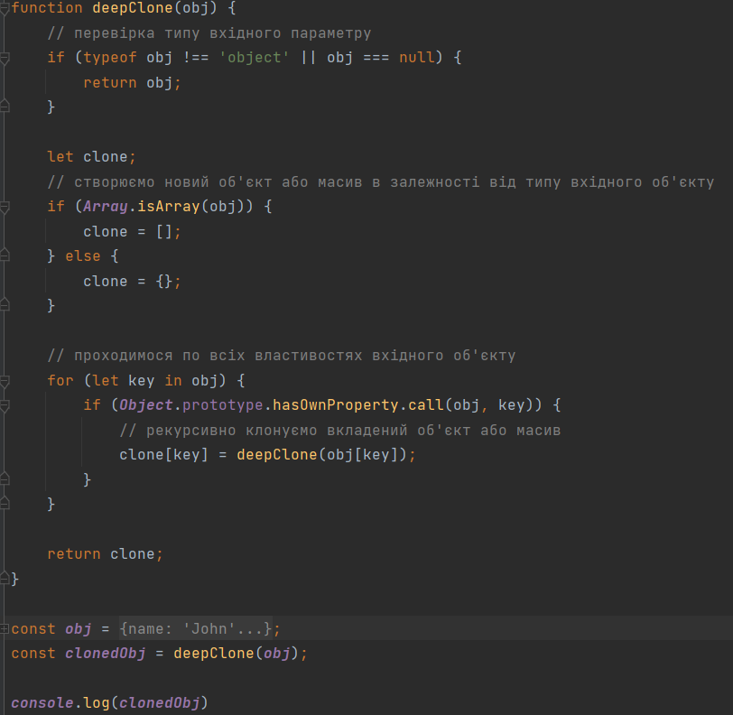
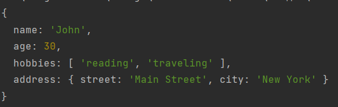
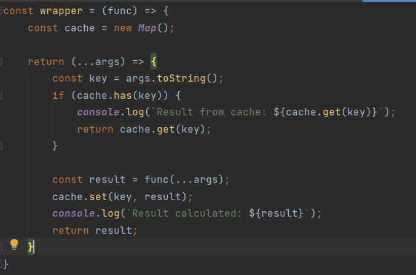
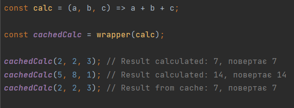
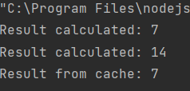

# node-labs

### Задача 1. Напишіть функцію add(), яка приймає будь-яку кількість параметрів у такому вигляді:
### console.log(add(2)(5)(7)(1)(6)(5)(11)()); // 37

Для розв'язання цієї задачі можна використати підхід з замиканням (closure). 
Нижче подано функцію add(), яка повертає нову функцію всередині себе.
Ця нова функція приймає число як параметр і повертає іншу нову функцію,
яка також приймає число як параметр.

Коли викликається функція без параметрів (за допомогою виклику add()()),
вона повертає суму всіх переданих раніше чисел.

### Задача 2. Напишіть функцію, яка бере два рядки і повертає true, якщо вони є анаграмами одне одного. *#

Спочатку я створюю нові змінні і присвоюю їм
значення рядків приведених до одного регістру. Далі порівнюю їх довжину та
посимвольно елементи з початку першого та з кінця другого слів. Якщо всі 
перевірки прошли успішно, повертаю true.

### Задача 3. Напишіть функцію, яка глибоко клонує об'єкт, переданий їй параметром.

Глибоке клонування об'єкту означає створення нового об'єкту з копією всіх 
вкладених об'єктів та масивів. Для досягнення цього можна використати рекурсивну
функцію, яка пройде по всіх властивостях об'єкта та створить новий об'єкт з 
копіями всіх властивостей.

Важливо зауважити, що ця функція не зможе клонувати функції та інші спеціальні 
типи даних, а також не збереже посилання на властивості.
Вона створить новий об'єкт з копіями всіх даних.

###  Задача 4. Напишіть функцію-обгортку, яка кешуватиме результат будь-якої іншої функції з довільною кількістю числових параметрів.

Для створення функції-обгортки, яка кешуватиме результат будь-якої іншої функції з довільною кількістю числових параметрів,
ми можемо використовувати об'єкт Map для зберігання результатів виклику функції за переданими їй аргументами.

Для тестування функції-обгортки ми можемо створити функцію calc() та скористатися обгорткою для кешування результатів її викликів:

Функція wrapper() приймає функцію func яку необхідно кешувати та повертає нову функцію, яка буде використовувати кеш для збереження та отримання результатів виклику переданої функції func з переданими їй аргументами.

Спочатку функція-обгортка перевіряє, чи є результат з переданими аргументами в кеші, за допомогою методу Map.has(). Якщо результат є в кеші, то функція повертає його та не виконує додаткових обчислень.

Якщо результат з переданими аргументами не знайдений в кеші, то функція-обгортка викликає передану функцію з переданими аргументами та зберігає результат в кеші за ключем, що представляє собою рядок з аргументами, за допомогою методу Map.set(). Функція-обгортка також повертає результат виклику переданої функції.

Кожен раз, коли викликається функція-обгортка з новими аргументами, вона шукає результат у кеші та повертає його, якщо результат уже був обчислений раніше. Якщо результат не був знайдений у кеші, то функція викликає передану функцію з новими аргументами та зберігає результат у кеші для майбутніх викликів.

